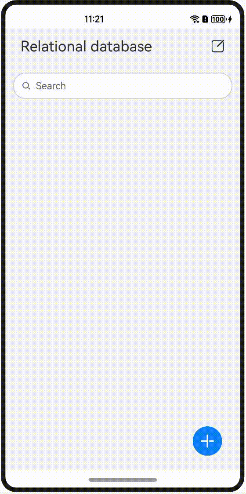

# RDB Store

### Overview

This codelab uses accounting as an example to illustrate how to use RDB store APIs to add, delete, modify, and query revenue and expenditure records. The following figure shows the effect.

### Concepts

- Relational database (RDB) store: manages data based on relational models. To satisfy different needs in complicated scenarios, the RDB store offers APIs for performing operations such as adding, deleting, modifying, and querying data, and supports direct execution of SQL statements.

### Permissions

N/A

### How to Use

1. On the app home page, touch the Add icon in the lower right corner. In the dialog box that is displayed, select an account item type, enter the amount, and tap OK to add an account item.
2. On the app home page, touch the Edit icon in the upper right corner, select the account item to be deleted, and touch the Delete icon at the bottom to delete the selected account item.
3. On the app home page, touch the account item to be edited. In the dialog box that is displayed, change the account item type or amount, and tap OK to modify the account item.
4. On the app home page, touch the search bar, enter the amount of the account item to be searched for, and touch the Search icon. The account item whose amount is the searched amount is displayed. If the search bar is empty, all account items are displayed.

### Constraints

1. The sample is only supported on Huawei phones with standard systems.
2. HarmonyOS: HarmonyOS NEXT Developer Beta1 or later.
3. DevEco Studio: DevEco Studio NEXT Developer Beta1 or later.
4. HarmonyOS SDK: HarmonyOS NEXT Developer Beta1 SDK or later.
