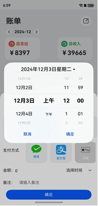

# 关系型数据库

### 简介

喜欢记得给个star

本Codelab以记账为例，使用关系型数据库的相关接口实现了对账单的增、删、改、查操作。效果图如下：

### 相关概念

- 关系型数据库：基于关系模型来管理数据的数据库，提供了增、删、改、查等接口，也可运行输入的SQL语句满足复杂场景需要。

### 相关权限

不涉及

### 使用说明

如图

### 依赖

依赖开源图表库  [mpchart](https://gitee.com/openharmony-tpc/ohos_mpchart#%E7%AE%80%E4%BB%8B)

`ohpm install @ohos/mpchart`

### 约束与限制

1. 本示例仅支持标准系统上运行，支持设备：华为手机。
2. HarmonyOS系统：HarmonyOS NEXT Developer Beta1及以上。
3. DevEco Studio版本：DevEco Studio NEXT Developer Beta1及以上。
4. HarmonyOS SDK版本：HarmonyOS NEXT Developer Beta1 SDK12及以上。
